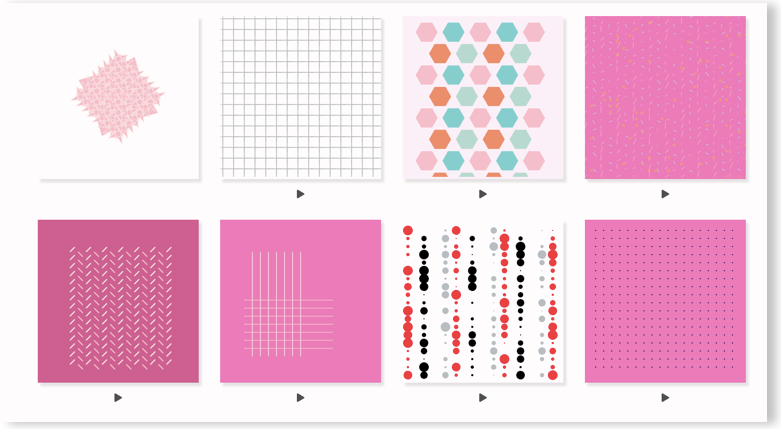

🚧 **Work in progress**

# Generative-design

> A collection of generative design React components

This repository contains a collection of generative design React components with which you can play, alter parameters and generate different designs with the same computation model.

## Table of contents

[What is generative design ?]()

[Why code ?]()

[Installing and using components]()

[Usage with Framer X]()

[Benefits of using computation model]()

[Techniques]()

[Resources]()
